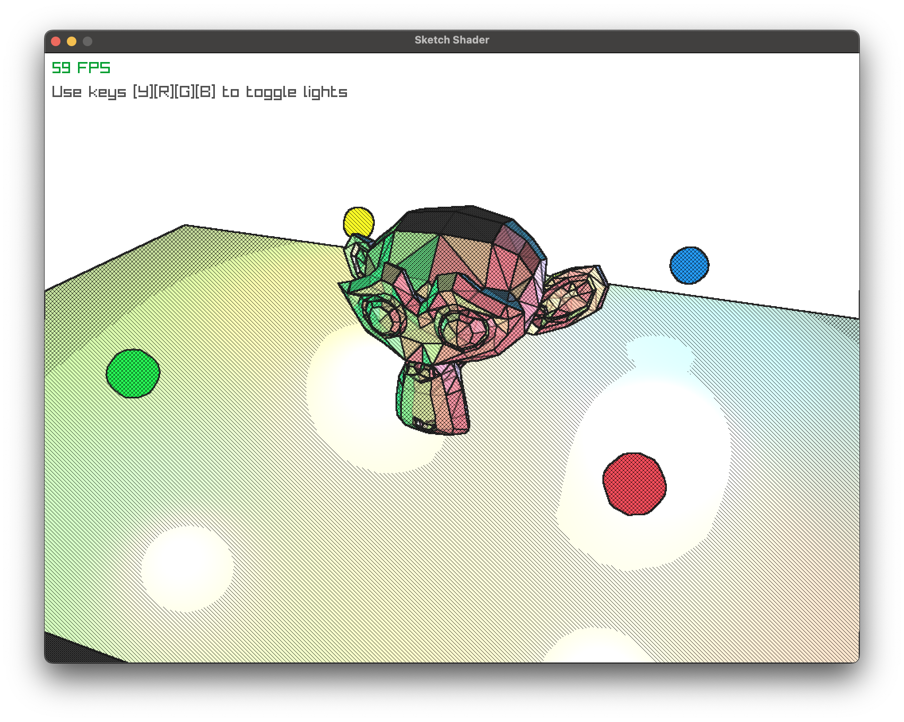

# Bello!!!!

This is an experiment with [raylib](https://github.com/raysan5/raylib). Not sure what it will become, but I will try to be creative.

## Run
Install Zig if you haven't done so. You can find the instructions [here](https://ziglang.org/download/).
Then build and run the project with:

```bash
zig build run
```

## Sketch Shading


